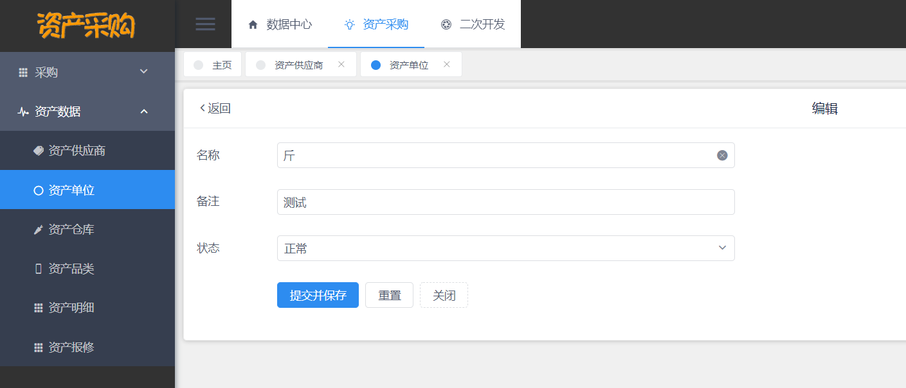
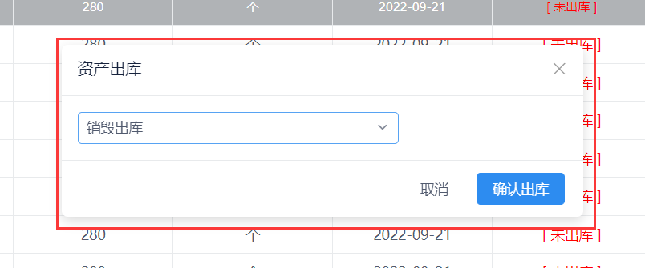

# 基于 Vue 和 SpringBoot 的资产采购管理系统

## 软件简介

本软件是**基于 Vue 和 SpringBoot 的资产采购管理系统**，支持对**资产供应商、资产品类、资产单位、资产出入库、资产明细、资产采购、资产报修**数据进行维护，**适用于中小企业管理行政办公资产**。系统给每个资产档案提供一个唯一标识，对物品入库、出库等各个作业环节进行快速批量的数据采集，确保中小企业及时掌握资产库存的真实数据，合理保持和控制企业库存。另外系统还包括员工管理、组织机构管理、文件管理、权限管理功能，给中小企业提供更个性化的资产管理模式。

资产采购管理系统**采用了基于角色的访问控制**，角色和菜单关联，一个角色可以配置多个菜单权限；然后再将用户和角色关联，一位用户可以赋予多个角色。这样用户就可以根据角色拿到该有的菜单权限，更方便中小企业管理人员进行权限管控。

本系统还**封装了文件管理功能**，在其他模块如若要实现图片/文件上传预览时，前端只需导入现成的 Vue 组件即可实现（使用 viewerjs 依赖实现），后端只需定义 String 类型的实体类变量即可，无需再去研究文件上传预览的相关功能，简化了开发者的工作量。

本系统还自带**基于 beetl 代码生成器**功能，开发者只需要输入类名（如 Student）和类备注（如学生），运行 main 函数即可自动生成后端的所有 MVC 结构代码，无需开发增删改查的 API 接口。对于前端，开发者只需输入后端实体类的完整路径，利用 Java 的反射原理，拿到后端实体类的字段，即可自动生成前端所有代码，生成的模块代码包含基础的增删改查功能，简化开发者的工作量。

本系统基于<https://gitee.com/yyzwz/template>进行二次开发。

### 云盘模块

### 条形图示例

### 饼图示例

### 折线图示例

### 柱状图示例

## 软件技术选型

### 前端

Vue：Vue 是构建前端界面的核心框架，本系统采用 2.6.14 版本。

View UI：基于 Vue.js 2.0 的组件库，本系统采用 4.7.0 版本。

### 后端

Spring Boot：构建系统核心逻辑的后端框架，本系统采用 2.7.0 版本。

MyBatis / MyBatis Plus：后端连接数据库的框架，本系统采用 3.5.2 版本。

### 数据库

MySQL：本项目的主数据库，本系统采用 8.0.30 版本。

Redis：本系统采用基于 Windows 版本的 Redis，用于图形验证码和用户菜单权限的临时存储，采用了 5.0.14 版本。

### 开发环境

VsCode：项目前端的开发工具，使用版本为 1.68.0。

IntelliJ IDEA ：项目后端的开发工具，使用版本为 2021.3.2。

Jdk：Java 的开发环境，使用版本为 17.0.3.1。

Maven：后端项目的打包工具，使用版本为 3.6.2。

NodeJs：前端项目的开发环境，使用版本为 16.13.0。

## 软件架构分析

基于 Vue 和 SpringBoot 的资产采购管理系统包括了系统基础模块、资产品类维护模块、资产采购模块、资产明细模块这四大功能模块，其架构如下图所示。

接下来，分别对资产采购管理系统的四大模块进行详细介绍。

## 系统基础模块

系统基础模块，是用于支撑资产采购管理系统的正常运行，这个模块包括了登陆注册模块、员工部门管理、菜单权限管理等。

资产出入库管理系统支持用户使用账号、密码和图形验证码登陆，操作界面如下图所示。

用户输入正确的账号（如 admin）、密码（如 123456）和图形验证码后，点击登陆按钮，即可进入到系统首页，系统登陆的流程如下图所示。

资产出入库管理系统支持用户使用手机号、姓名、密码和图形验证码注册，操作界面如下图所示。

用户输入正确格式的手机号（如 17857050001）、姓名（张三）、密码（如 123456）和图形验证码后，点击注册按钮，即可完成注册。注册成功后会自动跳转到登陆页，需要用户用注册的手机号和密码进行登陆，系统注册的流程图如下所示。

用户成功进入系统后，可进入到基于 Vue 和 SpringBoot 的资产采购管理系统的首页，首页展示了当前登陆的地址、现在的时间和用户配置的常用模块，如下图所示。

用户点击左侧的用户管理，即可进入用户管理模块，用户管理模块的首页如下图所示。

用户可以在这个模块对系统登陆用户的档案进行维护，包括添加新用户、删除用户、编辑用户、根据姓名/部门查询用户。

用户可以进入部门管理模块，管理中小企业的部门数据，如下图所示。

同理用户可以进入到菜单管理模块，对系统的菜单进行管理，菜单管理模块的操作界面如下图所示。

用户可以进入到角色管理模块，对单个角色赋予指定的菜单权限，从而让用户拥有指定角色的菜单权限，角色权限分配的界面如下图所示。

## 资产品类维护模块

第二个模块是资产品类维护模块，这个模块分为四个分模块，分别是资产供应商维护、资产单位维护、资产仓库维护和资产品类维护，如下图所示。

## 资产供应商维护

资产供应商维护模块，用于维护提供资产的厂家档案，供应商是资产的来源，所以需要有这个模块对供应商数据进行维护，供应商的字段明细如下。

| 字段名称    | 数据类型 | 长度 | 字段含义     | 备注       |
| ----------- | -------- | ---- | ------------ | ---------- |
| Id          | Varchar  | 255  | 唯一标识     | 非空，主键 |
| bm          | Varchar  | 255  | 编码         | 非空       |
| name        | Varchar  | 255  | 供应商名称   | 非空       |
| type        | Varchar  | 50   | 类型         | 非空       |
| address     | Varchar  | 255  | 供应商地址   | 非空       |
| mobile      | Varchar  | 255  | 联系电话     | 非空       |
| url         | Varchar  | 255  | 供应商官网   | 非空       |
| remark      | Varchar  | 255  | 备注         |            |
| status      | Boolean  | 15   | 供应商状态   | 非空       |
| Create_time | DateTime | 15   | 创建时间     | 自动生成   |
| Create_by   | Varchar  | 50   | 创建人       | 自动生成   |
| Update_time | DateTime | 15   | 最后更新时间 | 自动生成   |
| Update_by   | Varchar  | 50   | 最后更新人   | 自动生成   |

根据数据库字段明细，供应商模块的操作界面如下图所示。

用户可以点击顶部的“新增”按钮，进入供应商添加界面，添加供应商数据，如下图所示。

用户可以对现有的供应商数据进行编辑更新，只需点击每一行供应商数据的“编辑”按钮，即可进入供应商数据的编辑界面，如下图所示。

用户也可以对不需要的供应商进行删除操作，用户点击删除时，系统会弹出二次确认弹框。

## 资产单位维护

资产单位维护模块，用于维护资产单位档案，单位是资产的属性之一，所以需要有这个模块对资产单位数据进行维护，资产单位的字段明细如下。

| 字段名称    | 数据类型 | 长度 | 字段含义     | 备注       |
| ----------- | -------- | ---- | ------------ | ---------- |
| Id          | Varchar  | 255  | 唯一标识     | 非空，主键 |
| bm          | Varchar  | 255  | 编码         | 非空       |
| name        | Varchar  | 255  | 单位名称     | 非空       |
| remark      | Varchar  | 255  | 单位备注     |            |
| status      | Boolean  | 15   | 单位状态     | 非空       |
| Create_time | DateTime | 15   | 创建时间     | 自动生成   |
| Create_by   | Varchar  | 50   | 创建人       | 自动生成   |
| Update_time | DateTime | 15   | 最后更新时间 | 自动生成   |
| Update_by   | Varchar  | 50   | 最后更新人   | 自动生成   |

根据数据库字段明细，资产单位模块的操作界面如下图所示。

用户可以点击顶部的“新增”按钮，进入资产单位添加界面，添加资产单位数据，如下图所示。

用户可以对现有的资产单位数据进行编辑更新，只需点击每一行资产单位数据的“编辑”按钮，即可进入资产单位数据的编辑界面，如下图所示。

用户也可以对不需要的资产单位数据进行删除操作，用户点击删除时，系统会弹出二次确认弹框。

## 资产仓库维护

资产仓库维护模块，用于维护资产仓库档案，仓库也是资产的属性之一，所以需要有这个模块对资产仓库数据进行维护，资产仓库的字段明细如下。

| 字段名称    | 数据类型 | 长度 | 字段含义     | 备注       |
| ----------- | -------- | ---- | ------------ | ---------- |
| Id          | Varchar  | 255  | 唯一标识     | 非空，主键 |
| Name        | Varchar  | 255  | 仓库名称     | 非空       |
| address     | Varchar  | 255  | 仓库地址     | 非空       |
| adminName   | Varchar  | 255  | 管理员姓名   | 非空       |
| adminId     | Boolean  | 1    | 管理员 ID     | 非空       |
| remark      | Varchar  | 255  | 备注         |            |
| status      | Boolean  | 1    | 状态         | 非空       |
| Create_time | DateTime | 15   | 创建时间     | 自动生成   |
| Create_by   | Varchar  | 50   | 创建人       | 自动生成   |
| Update_time | DateTime | 15   | 最后更新时间 | 自动生成   |
| Update_by   | Varchar  | 50   | 最后更新人   | 自动生成   |

根据数据库字段明细，资产仓库模块的操作界面如下图所示。

用户可以点击顶部的“新增”按钮，进入资产仓库的添加界面，添加资产仓库数据，如下图所示。

其中管理员输入表单为人员选择器，用户可以点击右侧红色的选择按钮，进入人员选择器中选择，如下图所示。

用户可以对现有的资产仓库数据进行编辑更新，只需点击每一行资产数据的“编辑”按钮，即可进入资产数据的编辑界面，如下图所示。

用户也可以对不需要的资产单位数据进行删除操作，用户点击删除时，系统会弹出二次确认弹框，如下图所示。

## 资产采购模块

第三个模块是资产采购模块，这个模块分为两个分模块，分别是资产采购申请模块和资产采购审核模块，如下图所示。

接下来分别对资产采购申请模块和资产采购审核模块进行详细说明。

资产采购申请模块，用于维护用户的采购申请。采购申请一般有仓管员根据员工的实际需求产生，确定购买量后提交采购申请，资产采购单的字段明细如下。

| 字段名称    | 数据类型   | 长度 | 字段含义     | 备注       |
| ----------- | ---------- | ---- | ------------ | ---------- |
| Id          | Varchar    | 255  | 唯一标识     | 非空，主键 |
| Name        | Varchar    | 255  | 资产名称     | 非空       |
| assetId     | Varchar    | 255  | 资产 ID       | 非空       |
| Type        | Varchar    | 255  | 资产分类     | 非空       |
| Bm          | Varchar    | 255  | 资产编码     | 非空       |
| Spec        | Varchar    | 255  | 规格         | 非空       |
| Modal       | Varchar    | 255  | 型号         | 非空       |
| Cc          | Varchar    | 255  | 尺寸         | 非空       |
| cz          | Varchar    | 255  | 材质         | 非空       |
| Unit        | Varchar    | 255  | 计量单位     | 非空       |
| Bzdw        | Varchar    | 255  | 包装单位     | 非空       |
| Syfw        | Varchar    | 255  | 使用范围     | 非空       |
| Mrck        | Varchar    | 255  | 默认仓库 ID   | 非空       |
| MrckName    | Varchar    | 255  | 默认仓库名称 | 非空       |
| maxMoney    | BigDecimal | 15   | 采购价       | 非空       |
| minMoney    | BigDecimal | 15   | 销售价       | 非空       |
| gys         | Varchar    | 255  | 供应商 ID     | 非空       |
| GysName     | Varchar    | 255  | 供应商名称   | 非空       |
| imageUrl    | Varchar    | 255  | 物料图片     | 非空       |
| quantity    | BigDecimal | 15   | 数量         | 非空       |
| quantity    | BigDecimal | 15   | 可入库数量   | 非空       |
| Remark      | Varchar    | 255  | 备注         |            |
| auditFlag   | Integer    | 15   | 是否审核     | 非空       |
| submitFlag  | Integer    | 15   | 是否提交     | 非空       |
| wareFlag    | Integer    | 15   | 是否入库     | 非空       |
| Create_time | DateTime   | 15   | 创建时间     | 自动生成   |
| Create_by   | Varchar    | 50   | 创建人       | 自动生成   |
| Update_time | DateTime   | 15   | 最后更新时间 | 自动生成   |
| Update_by   | Varchar    | 50   | 最后更新人   | 自动生成   |

根据数据库字段明细，资产采购申请模块的操作界面如下图所示。

用户可以点击顶部的“新增”按钮，进入资产采购申请单的添加界面，添加资产采购申请单数据，如下图所示。

 

在资产采购单的添加页面中，资产是选择导入的，用户点击资产导入按钮后，会弹出以下界面。

用户需要双击资产，完成导入。导入后，添加表单中关于资产的数据自动填充，填充后的表单如下图所示。

用户只需要填写采购数量和采购原因即可，无需填写其他内容，如下图所示。

点击提交后，采购申请单自动生成，如下图所示。

此时采购单为未审核状态，需要采购员将创建的采购单提交审核。操作方法是先选择需要提交的采购单，再点击顶部的“提交审核”按钮即可，如下图所示。

点击后，系统会弹出二次确认框，点击确认即可，如下图所示。

采购单提交后，需要审核专员进行审核。审核专员可以进入到采购申请审核模块，主界面如下图所示。

采购员可以选择审核通过，或者审核驳回。若审核通过，审核状态将更新为已审核状态，仓管员可以继续进行入库，如下图所示。

此时仓管员进入到采购申请模块，相应采购单的入库按钮自动转为启用状态，仓管员可以点击此按钮，进入资产入库流程。

点击后，系统弹出以下弹框，如下图所示。

仓管员将对应的资产进行购买后，填写资产的入库数量、采购价格、采购日期和进入的仓库数据，填写后点击“确认入库”按钮即可，该资产采购单的入库状态改为已入库状态，如下图所示。

## 资产明细模块

第四个模块是资产明细模块，这个模块分为两个分模块，分别是资产明细模块和资产报修模块，如下图所示。

接下来分别对资产明细模块和资产报修模块进行详细说明。

资产明细模块，用于维护企业的资产数据，也就是企业有哪些资产类型，每一种资产类型分别有多少数量，领用了多少，还有多少。资产明细的字段明细如下。

| 字段名称    | 数据类型 | 长度 | 字段含义     | 备注       |
| ----------- | -------- | ---- | ------------ | ---------- |
| Id          | Varchar  | 255  | 唯一标识     | 非空，主键 |
| Name        | Varchar  | 255  | 资产名称     | 非空       |
| money       | Varchar  | 255  | 采购价       | 非空       |
| unit        | Varchar  | 255  | 计量单位     | 非空       |
| No          | Integer  | 15   | 唯一编码     | 非空       |
| model       | Varchar  | 255  | 型号         | 非空       |
| spec        | Varchar  | 255  | 规格         | 非空       |
| demand      | Varchar  | 255  | 需求         | 非空       |
| remark      | Varchar  | 255  | 备注         | 非空       |
| buyNumber   | Varchar  | 255  | 采购单 ID     | 非空       |
| buyDate     | Varchar  | 255  | 采购日期     | 非空       |
| warehouse   | Varchar  | 255  | 仓库         | 非空       |
| outFlag     | Integer  | 15   | 是否出库     | 非空       |
| giveType    | Varchar  | 255  | 领用类型     | 非空       |
| giveId      | Varchar  | 255  | 领用人 ID     | 非空       |
| giveName    | Varchar  | 255  | 领用人       | 非空       |
| outWork     | Varchar  | 255  | 出库操作人   | 非空       |
| outTime     | Varchar  | 255  | 出库时间     | 非空       |
| status      | Integer  | 15   | 资产状态     | 非空       |
| destroyName | Varchar  | 255  | 销毁人       |            |
| destroyTime | Varchar  | 255  | 销毁时间     |            |
| Create_time | DateTime | 15   | 创建时间     | 自动生成   |
| Create_by   | Varchar  | 50   | 创建人       | 自动生成   |
| Update_time | DateTime | 15   | 最后更新时间 | 自动生成   |
| Update_by   | Varchar  | 50   | 最后更新人   | 自动生成   |

根据数据库字段明细，资产明细模块的操作界面如下图所示。

资产明细的数据来源自资产采购模块，当资产采购单完成入库后，自动在资产明细模块生成指定数量资产，仓管员可以选择报修或领用出库。

若仓管员申请资产报修，只需点击每一行资产的报修按钮，系统会提示报修成功，如下图所示。

接着就可以在资产报修模块查询到报修明细了，如下图所示。

若仓管员申请资产出库，只需点击每一行资产的出库按钮，进入资产出库的界面，如下图所示。

仓管员有三种出库方式，第一种是以个人名义出库领用，第二种是根据部门进行领用，第三种是销毁出库，代表资产已被摧毁或消耗。

若采用“按人出库”，需要选择出库人，如下图所示。

若选择“按部门出库”，则要选择出库的部门，如下图所示。

若选择“销毁出库”，无需选择直接点确认即可，如下图所示。

## 项目总结

本软件是基于 **Vue 和 SpringBoot 的资产采购管理系统**，包含了**系统基础模块、资产品类维护模块、资产采购模块、资产明细模块**这四个功能模块。

开发本系统的目的，就是为了能否提高仓库运维的效率，间接降低人力成本，从而提高中小企业的效益。

## 免责声明

- 本项目开源，仅供个人学习使用，**转发 / 商用授权请联系作者，否则后果自负**。
- 作者拥有本软件构建后的应用系统全部内容所有权及独立的知识产权（**软件著作权登记号：2022SR1338866**）。
- 如有问题，欢迎在仓库 Issue 留言，看到后会第一时间回复。相关意见会酌情考虑，但没有一定被采纳的承诺或保证。

下载本系统代码的用户，**必须同意以下内容，否则请勿下载**！

1. 出于自愿而使用/开发本软件，了解使用本软件的风险，且同意自己承担使用本软件的风险。
2. 利用本软件构建的网站的任何信息内容以及导致的任何版权纠纷和法律争议及后果和作者无关，作者对此不承担任何责任。
3. 在任何情况下，对于因使用或无法使用本软件而导致的任何难以合理预估的损失（包括但不仅限于商业利润损失、业务中断与业务信息丢失），作者概不承担任何责任。
4. 必须了解使用本软件的风险，作者不承诺提供一对一的技术支持、使用担保，也不承担任何因本软件而产生的难以预料的问题的相关责任。
